

  

<h1>On-premises Active Directory Deployed in the Cloud (Azure)</h1>
This tutorial outlines the implementation of an on-premises-style Active Directory environment deployed within Microsoft Azure Virtual Machines. 

<h2>Environments and Technologies Used</h2>

- Microsoft Azure (Virtual Machines / Compute)
- Remote Desktop (RDP)
- Active Directory Domain Services (AD DS)
- PowerShell

<h2>Operating Systems Used</h2>

- Windows Server 2022
- Windows 10 (21H2)

<h2>High-Level Deployment and Configuration Steps</h2>

- Deploy and configure the Domain Controller (DC-1)
- Deploy and configure the Client (Client-1)
- Verify connectivity and DNS configuration
- Prepare for future Active Directory labs

<h2>Deployment and Configuration Steps</h2>

<h3>Setup Domain Controller in Azure</h3>

  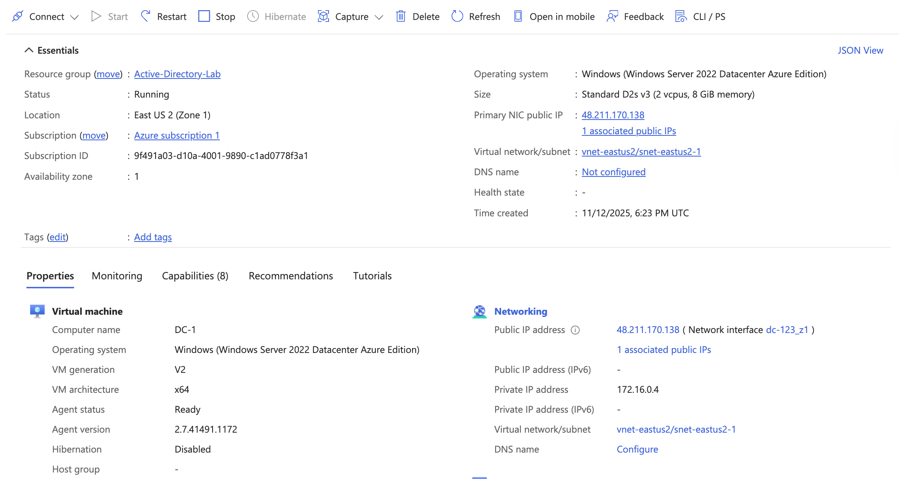

<strong>1.</strong> Create a <strong>Resource Group</strong> in the Azure Portal. 
<strong>2.</strong> Create a <strong>Virtual Network</strong> and <strong>Subnet</strong>. 
<strong>3.</strong> Create the <strong>Domain Controller VM</strong> using the following details:
<ul>
  <li><strong>Name:</strong> DC-1</li>
  <li><strong>Operating System:</strong> Windows Server 2022</li>
  <li><strong>Username:</strong> labuser</li>
  <li><strong>Password:</strong> Cyberlab123!</li>
</ul>
<strong>4.</strong> After creation, set the Domain Controller’s <strong>NIC Private IP address to Static</strong>. 
<strong>5.</strong> Log in to <strong>DC-1</strong> via Remote Desktop. 
<strong>6.</strong> Disable the <strong>Windows Firewall</strong> (for testing connectivity). 

  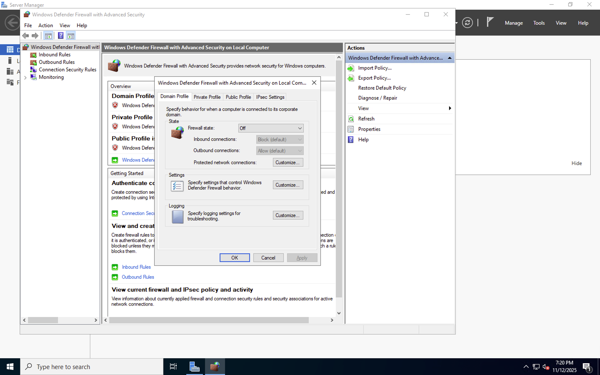

 

<h3>Setup Client-1 in Azure</h3>

  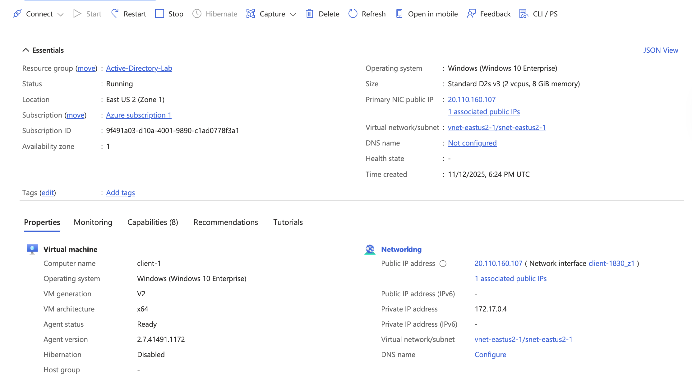

<strong>1.</strong> Create the <strong>Client VM</strong> using the following details:
<ul>
  <li><strong>Name:</strong> Client-1</li>
  <li><strong>Operating System:</strong> Windows 10 (21H2)</li>
  <li><strong>Username:</strong> labuser</li>
  <li><strong>Password:</strong> Cyberlab123!</li>
</ul>
<strong>2.</strong> Attach Client-1 to the <strong>same region and Virtual Network</strong> as DC-1. 
<strong>3.</strong> After creation, set <strong>Client-1’s DNS settings</strong> to DC-1’s Private IP address. 
<strong>4.</strong> From the Azure Portal, <strong>restart Client-1</strong>. 
<strong>5.</strong> Log in to Client-1 using Remote Desktop. 
<strong>6.</strong> Open Command Prompt and <strong>ping DC-1’s private IP address</strong>. 

  

<strong>7.</strong> Confirm that the ping succeeds, verifying network connectivity between both VMs. 
<strong>8.</strong> From Client-1, open <strong>PowerShell</strong> and run:
<pre><code>ipconfig /all</code></pre>
<strong>9.</strong> Verify that the <strong>DNS server</strong> is set to DC-1’s private IP address.

  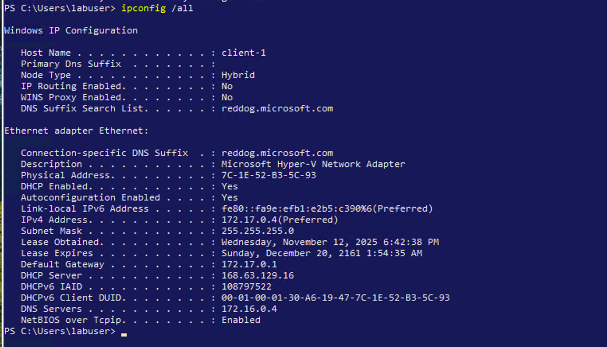

Part 1 — Deploy & Configure Active Directory

1. Install Active Directory Domain Services (AD DS)
	1.	Log into DC-1.
	2.	Open Server Manager → Add Roles and Features.
	3.	Install Active Directory Domain Services.
	4.	Promote DC-1 to a Domain Controller.
	5.	Create a new forest: mydomain.com
	6. Restart and log back in as mydomain.com\labuser
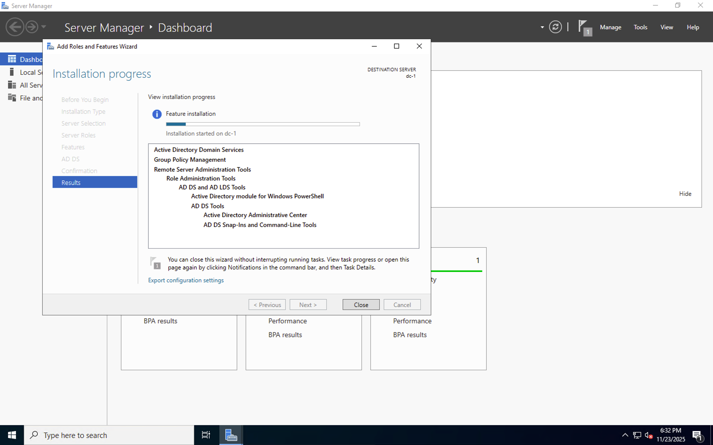
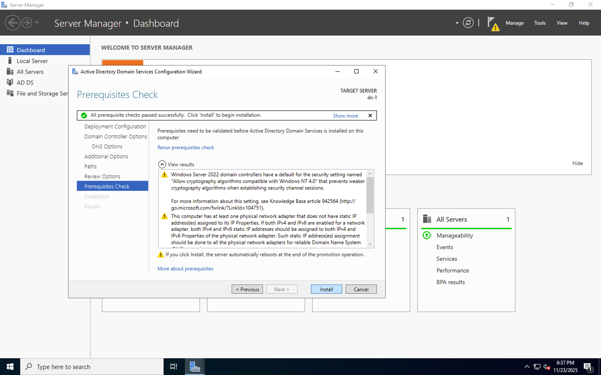

2. Create a Domain Admin User
	1.	Open Active Directory Users and Computers (ADUC).
	2.	Create:
	    _EMPLOYEES OU
	    _ADMINS OU
	3.	Create a user:
    Name: Jane Doe
	Username: jane_admin
	Password: Cyberlab123!
	4.	Add jane_admin to: Domain Admins
   	5.	Log out and log in as: mydomain.com\jane_admin
  
	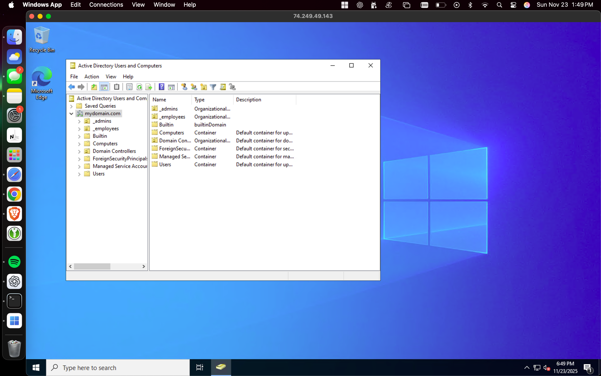
	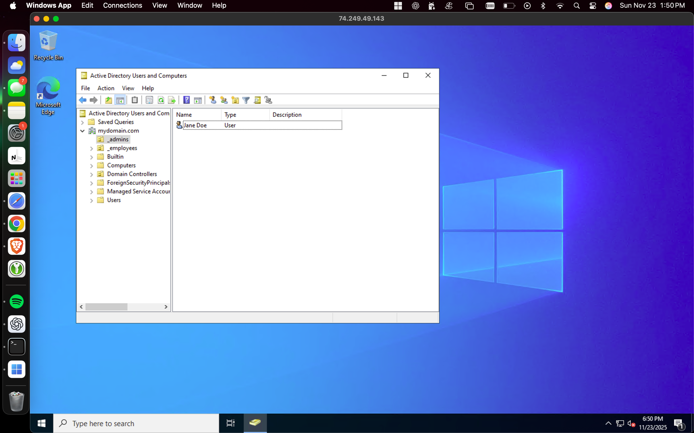

---

4. Join Client-1 to the Domain
	1.	DNS already set in Azure to point Client-1 to DC-1.
	2.	Restart Client-1.
	3.	Log in as local admin: labuser
 	4.	Join domain: mydomain.com
  	5.	Restart Client-1.
	6.	In ADUC, verify Client-1 appears.
	7.	Create OU: _CLIENTS
	8.	Move Client-1 into it.

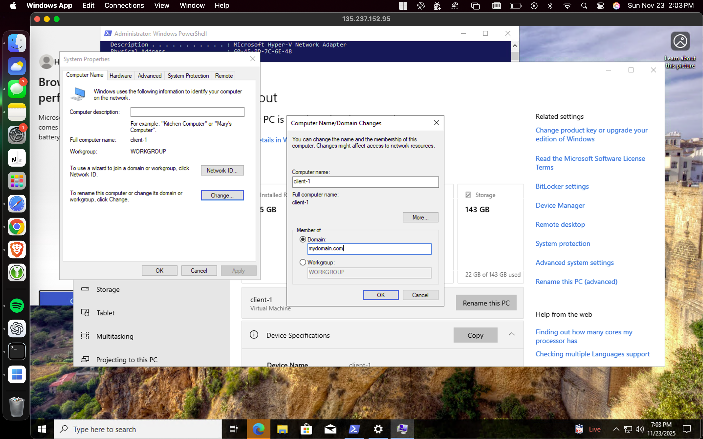
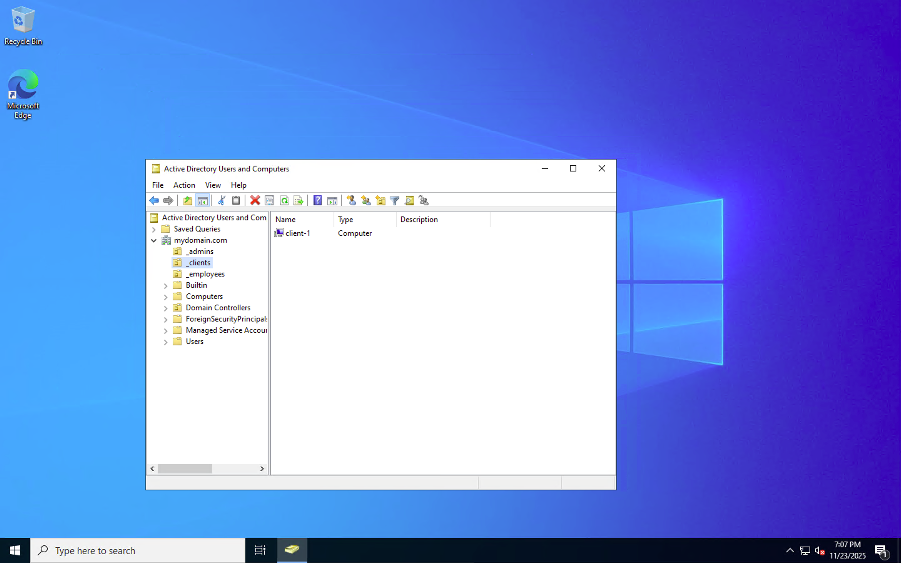

---

Part 2 — Enable RDP + Bulk User Creation

1. Enable Remote Desktop for Domain Users on Client-1
		1.	Log into Client-1 as: mydomain.com\jane_admin
    	2.	Open: System Properties → Remote Desktop
        3.	Add: Domain Users

2. Bulk Create Users with PowerShell
	1.	Log into DC-1 as jane_admin.
	2.	Open PowerShell ISE as Administrator.
	3.	Paste the bulk user creation script.
	4.	Run it and observe user creation.

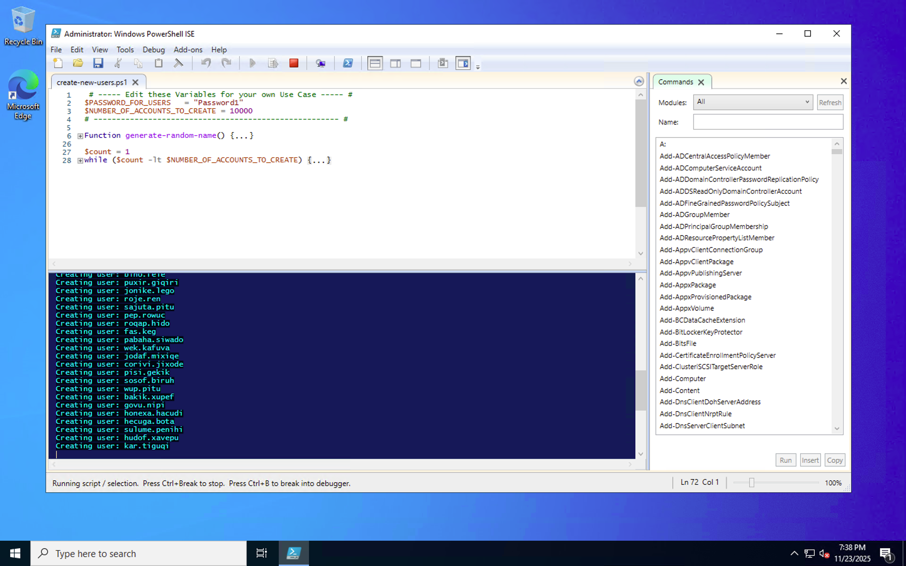

3. Verify Accounts in ADUC

Users should appear under the _EMPLOYEES OU.

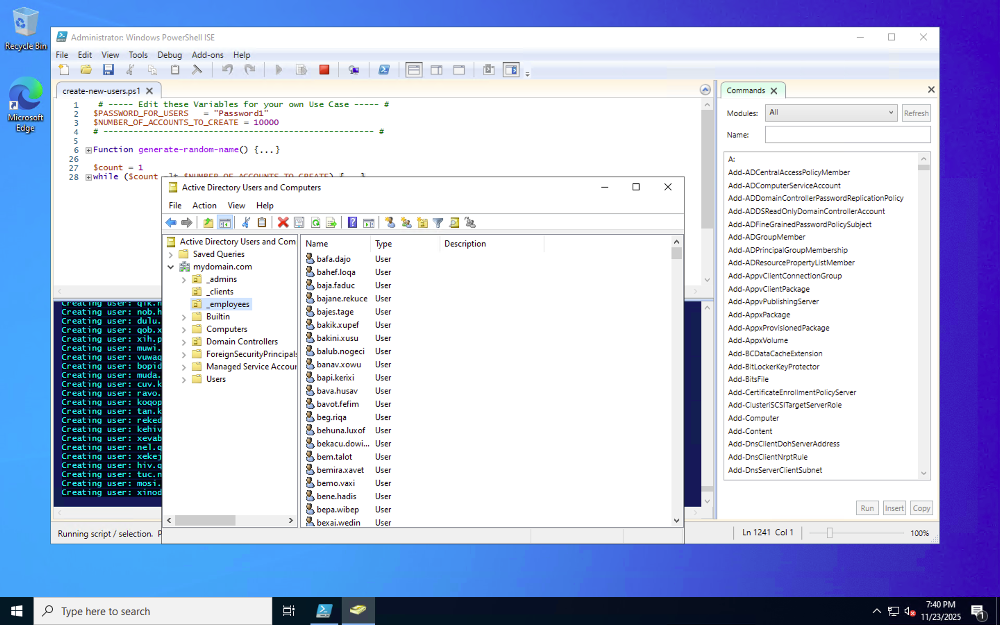

4. Test Login With One of the New Accounts

Use RDP to log into Client-1 with a newly created user account.
Login: mydomain.com\daxer.rop
Password: Password1

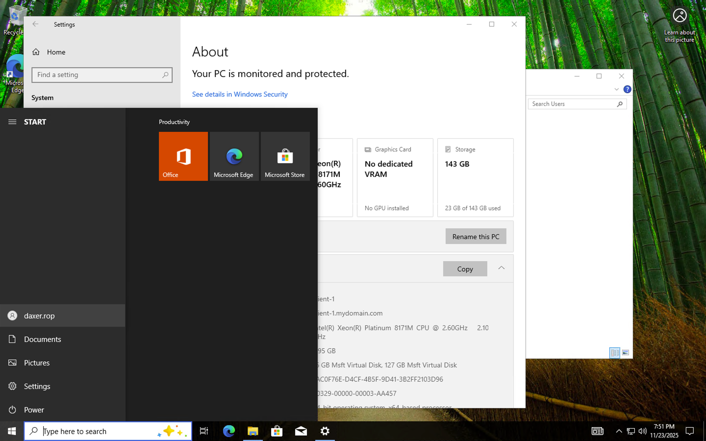

---

🔐 Active Directory Lab — Account Lockouts, Logs, and Account Management

📌 Overview

This section continues the Active Directory environment created earlier using Azure VMs (DC-1 and Client-1).
In this lab, I will:
	•	Simulate and observe account lockouts
	•	Configure Group Policy lockout thresholds
	•	Enable/disable AD accounts
	•	Review logs on the Domain Controller and Client
	•	Understand behavior relevant to cybersecurity and security operations

⸻
🚀 Part 1 — Simulating Account Lockouts

✔️ 1. Ensure Both VMs Are Running

Turn on DC-1 and Client-1 in the Azure Portal if they are off.

Screenshot Placeholder:
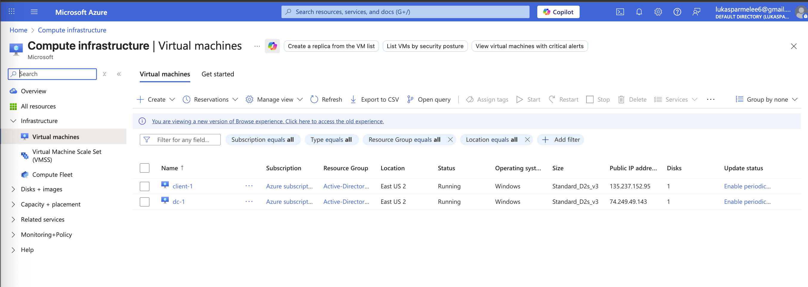

⸻

✔️ 2. Log Into the Domain Controller (DC-1)

Screenshot Placeholder:
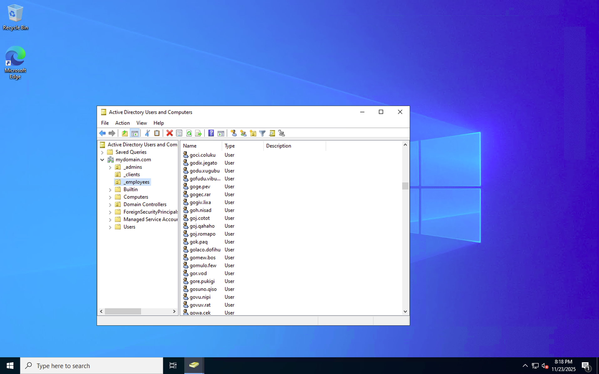

⸻

✔️ 3. Select a User to Test

Choose any user account previously created (from the bulk user creation script or manually).
I will login with

User: gok.paq
Password: Password1

⸻

🔧 Part 2 — Configure Group Policy Account Lockout

✔️ 1. Open Group Policy Management on DC-1

Navigate to:

Group Policy Management → Default Domain Policy → Edit 

Screenshot Placeholder:
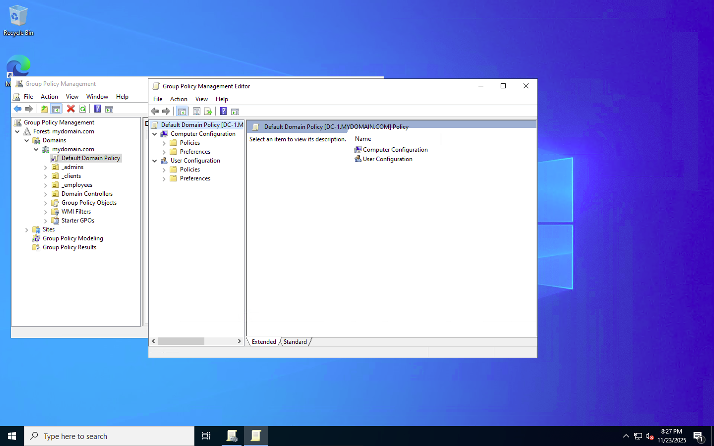

⸻

✔️ 2. Set Account Lockout Threshold

Path:

Computer Configuration → Policies → Windows Settings → Security Settings → Account Policies → Account Lockout Policy

Configure:
	•	Account Lockout Threshold: 5 attempts
	•	Automatically sets:
	•	Reset account lockout counter: 10 minutes 
	•	Account lockout duration: 30 minutes

Screenshot Placeholder:
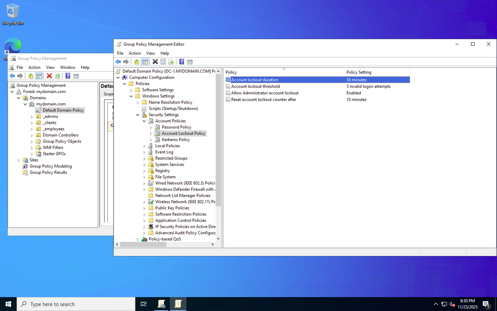

⸻

✔️ 3. Force Policy Update

Run on DC-1 and Client-1: gpupdate /force

Screenshot Placeholder:

✔️ 4. Trigger Lockout

Attempt to log in 6 times with the wrong password — the account should lock after 5 failed attempts.

User: gok.paq
Password: Password1

Screenshot Placeholder:
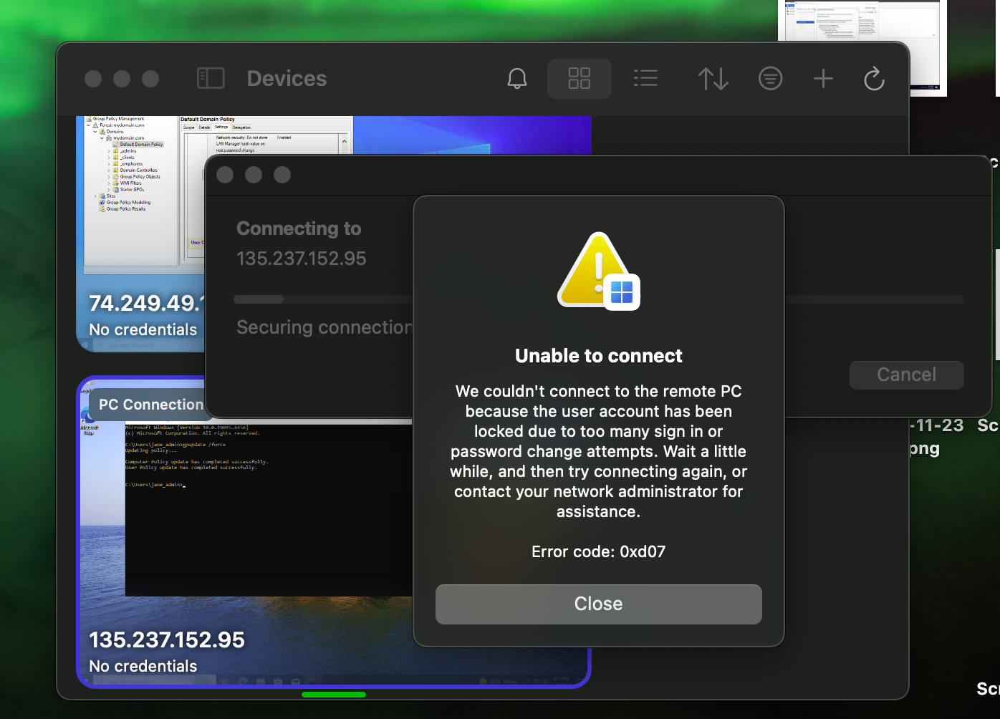

⸻

✔️ 5. Verify Lockout in Active Directory

In Active Directory Users and Computers (ADUC):
	•	Find the user
	•	Notice the “Account is locked out” message

Screenshot Placeholder:
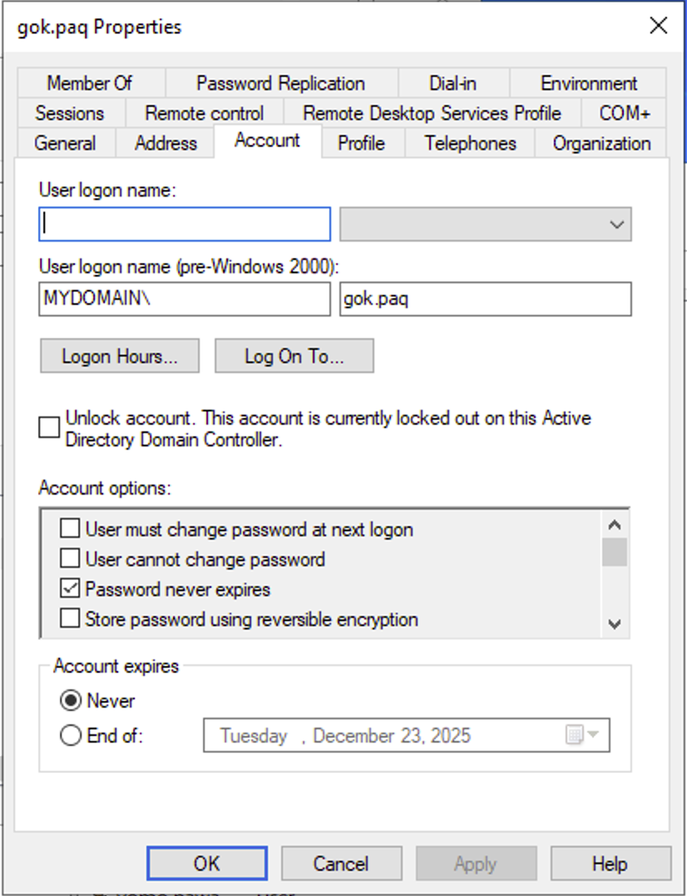

⸻

✔️ 6. Unlock and Reset Password

From the user account properties:
	•	Uncheck “Unlock account”
	•	Reset password if needed
	•	Attempt login again

Screenshot Placeholder:
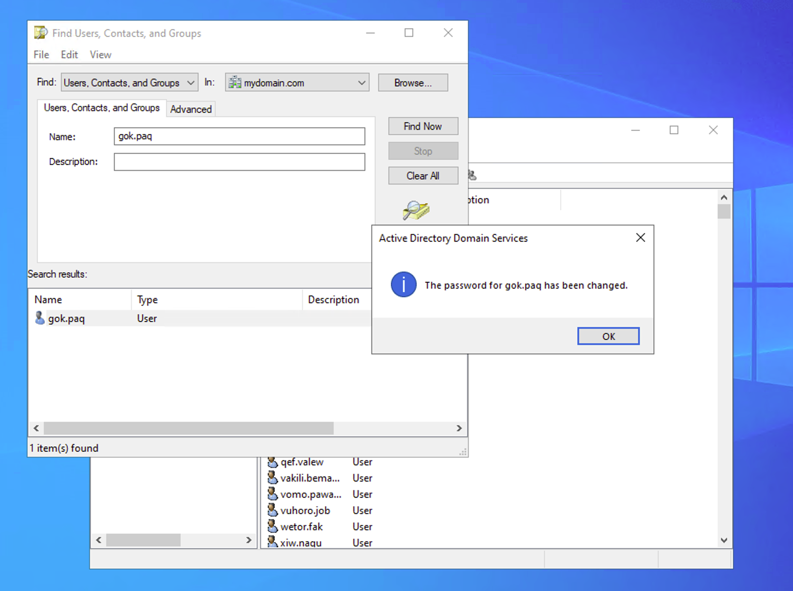

⸻

🧩 Part 3 — Enabling & Disabling Accounts

✔️ 1. Disable the Account in ADUC

Right-click the user → Disable Account

I Disabled the account gok.paq

Screenshot Placeholder:
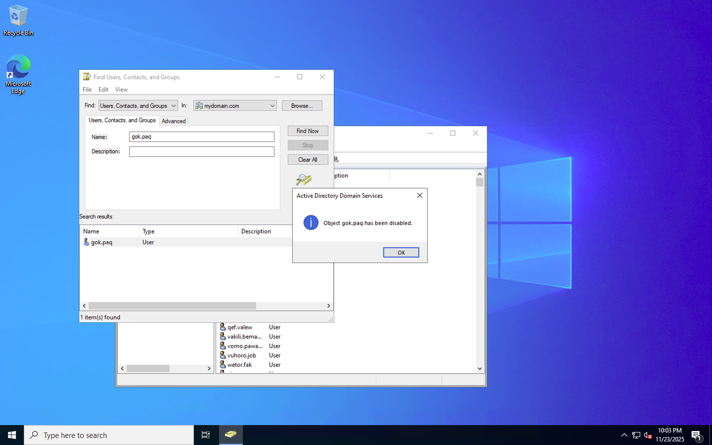

⸻

✔️ 2. Attempt Login

Login should fail with a “Your account has been disabled” message.

Attemped login with gok.paq

Screenshot Placeholder:
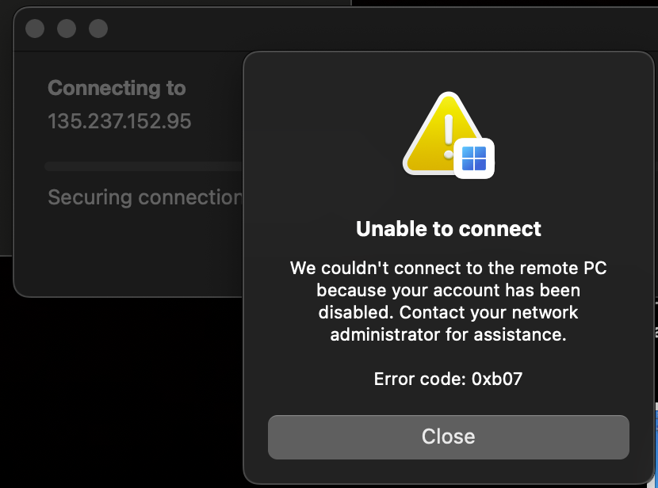

⸻

✔️ 3. Re-Enable the Account

Right-click user → Enable Account
Attempt login again.

Screenshot Placeholder:

